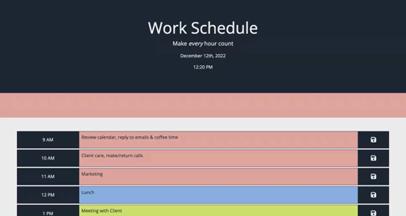
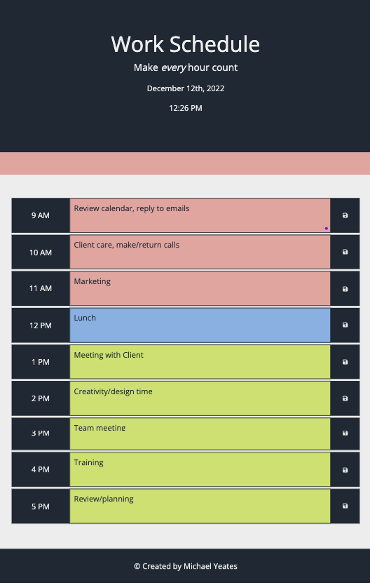

<!-- PROJECT LOGO -->
 

  

<h3 align="center">Daily Planner</h3>

  

  Make <em>every</em> hour count with this simple Daily Planner App. You can keep track of all important appointments during a normal 9-5 work day!

 
<a href="https://github.com/ajmoradiya6/daily-planner"><strong>Explore the docs »</strong></a>
 
 
<a href="https://ajmoradiya6.github.io/daily-planner/">View Live Deployment</a>
·
<a href="https://github.com/ajmoradiya6/daily-planner/issues">Report Bug</a>
·
<a href="https://github.com/ajmoradiya6/daily-planner/issues">Request Feature</a>

  

<!-- TABLE OF CONTENTS -->

  
Table of Contents

  <ol>
    <li>
      <a href="#about-the-project">About The Project</a>
      <ul>
        <li><a href="#built-with">Built With</a></li>
      </ul>
    </li>
        <li><a href="#usage">Usage</a></li>
    <li><a href="#contributing">Contributing</a></li>
    <li><a href="#contact">Contact</a></li>
    <li><a href="#acknowledgments">Acknowledgments</a></li>
  </ol>

<!-- ABOUT THE PROJECT -->

## About The Project

[![Daily Planner][product-screenshot]](https://ajmoradiya6.github.io/daily-planner/)

User Story:

- AS AN employee with a busy schedule
- I WANT to add important events to a daily planner
- SO THAT I can manage my time effectively

Project Summary:

- The current day and time is displayed at the top of the calendar when a user opens the planner
- Timeblocks are dynamically created for the standard work day, 9am to 5pm
- Each timeblock is colour coded based on past (red), present (blue), and future (green)
- The user can enter an appointment on each timeblock
- When a user clicks the save button, the corresponding appointment is saved to localStorage, a save notification is displayed and an audio confirmation alert is played
- If a page is refreshed, the saved appointment is displayed in the relevant timeblock

During this project I learned how to:

- Use third-party API's such as jQuery and Moment.js to dynamically update a web page
- Implement DOM manipulation strategies using the jQuery library
- Create time-based operations using Moment.js

(<a href="#readme-top">back to top</a>)

### Built With

- [![Bootstrap][bootstrap.com]][bootstrap-url]
- [![JQuery][jquery.com]][jquery-url]

(<a href="#readme-top">back to top</a>)

## Usage

The following animation demonstrates the application functionality:

This application is mobile responsive and adjusts to fit different screen-sizes, for example:

(<a href="#readme-top">back to top</a>)

<!-- CONTRIBUTING -->

## Contributing

Contributions are what make the open source community such an amazing place to learn, inspire, and create. Any contributions you make are **greatly appreciated**.

If you have a suggestion that would make this better, please fork the repo and create a pull request. You can also simply open an issue with the tag "enhancement".
Don't forget to give the project a star! Thanks again!

1. Fork the Project
2. Create your Feature Branch (`git checkout -b feature/AmazingFeature`)
3. Commit your Changes (`git commit -m 'Add some AmazingFeature'`)
4. Push to the Branch (`git push origin feature/AmazingFeature`)
5. Open a Pull Request

(<a href="#readme-top">back to top</a>)

<!-- CONTACT -->

## Contact

Akshay Moradiya - [@ajmoradiya6](https://twitter.com/ajmoradiya6) - ajmoradiya6@gmail.com

Project Link: [https://github.com/ajmoradiya6/daily-planner](https://github.com/ajmoradiya6/daily-planner)

(<a href="#readme-top">back to top</a>)

<!-- ACKNOWLEDGMENTS -->

## Acknowledgments

- [Moment.js Docs](https://momentjs.com/)
- [JQuery Docs](https://jquery.com/)
- [Flat Icon](https://www.flaticon.com/free-icons/calendar)
- [Save SFX](https://mixkit.co/)
- [JQuery Cheat Sheet](https://htmlcheatsheet.com/jquery/)

(<a href="#readme-top">back to top</a>)

<!-- MARKDOWN LINKS & IMAGES -->

[linkedin-shield]: https://img.shields.io/badge/-LinkedIn-black.svg?style=for-the-badge&logo=linkedin&colorB=555
[linkedin-url]: https://linkedin.com/in/akshay-moradiya
[product-screenshot]: assets/images/screenshot.png
[bootstrap.com]: https://img.shields.io/badge/Bootstrap-563D7C?style=for-the-badge&logo=bootstrap&logoColor=white
[bootstrap-url]: https://getbootstrap.com
[jquery.com]: https://img.shields.io/badge/jQuery-0769AD?style=for-the-badge&logo=jquery&logoColor=white
[jquery-url]: https://jquery.com
